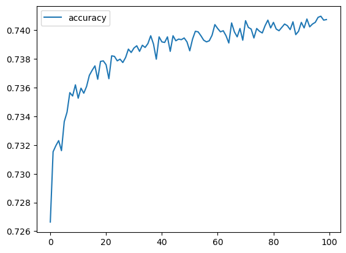
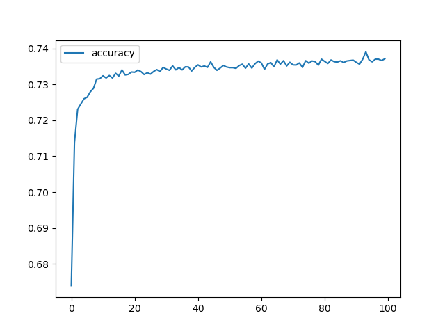

# Module 21 Report: Deep Learning Challenge

## Overview
In this analysis, we are helping the nonprofit foundation, Alphabet Soup, implement a binary classifier to help them select applicants for funding such that, if funded by them, whether they would succeed or not. In doing so, we are exploring the functions and capabilities of sklearn, and seeing what how we can best maximize the success rate of being able to predict whether applicants will be successful if funded.

### Data Preprocessing
Our "target" variable is the 'IS_SUCCESSFUL' data, which contains information regarding whether the money from funding was used effectively. The other features we look are at all but the EIN (Employee Identification Number) and their names: APPLICATION_TYPE (application type specifically for Alphabet Soup), AFFILIATION (sector industry), CLASSIFICATION (government organization classification), USE_CASE, ORGANIZATION (type), STATUS (active status), INCOME_AMT, SPECIAL_CONSIDERATIONS, and ASK_AMT. 

### Compiling, Training and Evaluating the Model
For this project, I used three different models: 

Attempt 1  
I first used 3 layers: first hidden layer had 22 neurons, second hidden layer had 11 neurons, and my output layer had 1 neuron. For activation functions, I just chose to work with ReLu and sigmoid functions since that's what we worked with. I chose to start with 22 neurons because it was about the middle point between the input dimension (43) and the number of output neurons (1), then 11 for the next layer since it's half of 22. 
I was not able to reach target model performance, with the accuracy at about 72.45%, wheras target performance was above 75%.

Attempt 2  
Next, I used 3 layers: the first hidden layer had 64 neurons, the second hidden layer had 32 neurons, and the output layer had 1 neuron. For activation functions, I kept to working with ReLu and sigmoid functions. Compared to the last attempt, I chose to increase the complexity of my next model (this second attempt model) since the accuracy seemed to plateau around 73% in the previous model. I thought that maybe increasing the complexity would allow the model to create a more detailed approach to its predictions, thus hopefully giving a higher success rate. 
I was still not able to reach target model performance, with the accuracy at about 72.56%- an improvement, but not by much.

In another attempt not documented in the file, I tried increasing just the number of hidden layers (4) but the precision decreased significantly, to just above 54%, so I scrapped the idea and stuck to working with 3 layers.

Attempt 3  
For my third attempt, I tried changing the applicaitons to be bucketed under "Other" together as well as the cutoff for classification, but the results seemed to be about the same with only a minor improvement in accuracy - approximately 72.70%. I tried to increase the complexity again, not by adding layers but by adding more neurons. I took the number of types of applications (17) and multiplied it by the classifications (71) and got 923 so I chose that for the number of neurons for the first layer. For the second layer, I just chose 71 for the number of neurons. 

In the image above, which shows the accuracy history throughout the model fitting process, we observe that the graph itself is quite inconsistent, although it does plateaus around 74%, with some variation.

Attempt 4  
Before continuing with this attempt, I tried adjusting the original groupings when cleaning the data since they were originally a bit random. I grouped "other" by the applications types that had less than 10 applicants. I chose to stick with epochs at 100 since that seems to be about where the graph begins to plateau (ie. where the model seems to have a stagnant value for its accuracy). Once again, the model experiences slight improvement with acceptable results, but nothing new, with accuracy plateauing around 74% again. The accuracy landed at approximately 72.70% this attempt. 

We observe considerable improvement over time in the graph of attempt #4's accuracy value over the course of fitting the model, though the graph still plateaus around 74% with less variation than the previous attempt.

There are a lot of layers to the data we're feeding the model, so I thought increasing the complexity could show a improvement. Increasing the complexity through each attempt has shown minor improvement, though the strucutre of the model hasn't reached the target goal of 75% accuracy.

## Results
Overall, the model has shown us that with complex problems and projects come complex models that we need to work with. There are a lot of "buckets" we're working with for Alphabet Soup Charity's application process, so there are needs to be a complex model made. Although the model's potential hasn't been reached, there is still a considerable amount of lesson to be learned from this project.  
For the next attempt, I would explore the difference in result by playing with the activation functions, and more layers. Increasing complexity increases runtime significantly, so this was an obstacle in working with this project. If more time was available, I could explore this more to see how each factor affects our results. For example, we're experiencing quite high less with each fitting, so I could explore ways to decrease this- either by changing the layering activation functions and by playing with the order.